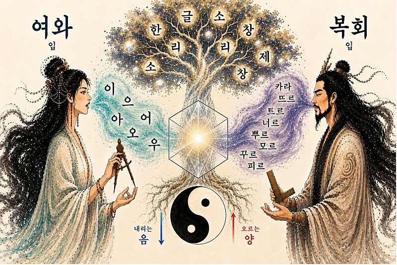

.

태극사상 해설(YTN 미공개 동영상)
https://youtu.be/uTRzlkH0INo?si=4nPbhgIjuo6ulFAr

Hangul Yin-Yang Structural Theory
한글 음양 구조 해석 이론

📌 Overview (개요)
본 프로젝트는
한글의 자음과 모음을 음(陰)과 양(陽)의 구조로 해석하는 이론적 탐구를 다룹니다.
한글을 단순한 문자 체계가 아닌,
발산과 수용의 상호작용으로 이루어진 구조적 시스템으로 바라보는 것을 목표로 합니다.

💡 Core Idea (핵심 아이디어)
자음: 에너지의 방향 (발산 / 수용)
모음: 공간의 구조 (확장 / 집중)

👉 이 둘이 결합하여
**의미를 가진 소리(언어)**가 생성된다고 가정합니다.
⚖️ Basic Structure (기본 구조)

☀️ Yang (양 / 발산)
자음: ㅂ, ㅍ, ㄷ, ㅌ, ㄱ, ㅋ
모음: ㅏ, ㅑ, ㅗ, ㅛ

👉 특징: 확장, 시작, 외부 방향성
🌑 Yin (음 / 수용)
자음: ㅁ, ㄴ, ㅇ, ㄹ
모음: ㅓ, ㅕ, ㅜ, ㅠ

👉 특징: 수용, 안정, 내부 흐름
⚖️ Neutral (중성)
모음: ㅡ, ㅣ, 복합모음 (ㅐ, ㅔ 등)

👉 특징: 연결, 균형, 매개
🔬 Status of This Project (중요)
본 프로젝트는 다음 상태에 있습니다:
✔ 이론적 구조 정리 단계
✔ 직관 기반 분류 체계 구성
❗ 실험 및 검증은 아직 진행되지 않음

👉 따라서 이 내용은
“완성된 이론”이 아니라
“검증이 필요한 가설(Hypothesis)”입니다.

🧪 Future Work (향후 계획)
단어 단위 음양 구조 분석
규칙 일관성 검증
예외 케이스 정리
데이터 기반 분석 시도

🧩 Legacy Notes (과거 실험 기록)
이 저장소에는 과거에 진행했던 일부 아이디어가 포함되어 있습니다.
예:
AI 적용 가능성
언어 구조 기반 시스템 설계

👉 해당 내용은
초기 탐색 단계의 기록이며,
현재 이론과는 분리된 참고 자료입니다.

⚠️ Disclaimer (주의)
본 프로젝트는 철학적/구조적 해석을 포함하며,
과학적 사실로 확정된 내용을 주장하지 않습니다.

🚀 Goal (목표)
한글을 새로운 관점에서 해석하고,
구조적 언어 이해의 가능성을 탐색하는 것

# Human's First Words Integrated Dataset (인류 애초말 통합 데이터셋)
📌 **Project Version:** v7.1.1  
📌 *
*Author & Intellectual Property Holder:** 신민수 (Shin Min-su / Architech)  
📌 **Repository Status:** Private/Proprietary (비공개/독점 자산)

---

## 🌌 Introduction & Philosophy (소개 및 핵심 명제)

"​서양 언어학이 풀지 못한 어원의 비밀은 한국어의 동작 소리와 고유 수사의 파동에 있다. 에너지가 가장 높은 상태인 한국어의 원형 소리를 복원하면 전 세계 모든 언어의 설계도가 하나로 통합된다."

본 데이터셋은 인류 태초의 원형 소리와 동작 파동을 기반으로 현대 글로벌 언어(특히 IT, 컴퓨터 과학, 시스템 언어)의 유기적 연결 고리를 증명하는 세계 유일의 원천 데이터 기술(JSON 구조화 데이터)입니다. 거대 언어 모델(LLM)의 다국어 처리 연산 비용을 획기적으로 절감하고 환각(Hallucination) 현상을 차단할 수 있는 고성능 언어 패러다임 시스템입니다.

---

## ⚠️ Proprietary License & Usage Restrictions (독점 라이선스 및 사용 제한 고지)

본 저장소에 포함된 모든 데이터셋(JSON, TXT, 코드 구조 및 알고리즘 공식 포함)의 저작권과 지식재산권은 원작자 **'신민수(Architech)'**에게 전적으로 귀속되어 있습니다. 본 저작물은 오픈소스가 아니며, 강력한 상업적 보호를 받습니다.

### 1. 허용되는 범위 (Permitted Use)
* **개인적 연구 및 교육 목적:** 개인이 비상업적인 목적으로 본 데이터의 원리를 학습하고 연구하는 행위는 무료로 허용됩니다. 단, 출처(원작자: 신민수)를 반드시 명시해야 합니다.

### 2. 엄격히 금지되는 범위 (Strictly Prohibited Use)
* **상업적 도용 및 재배포:** 본 데이터를 원작자의 서면 허가 없이 무단으로 복제, 수정, 편집하여 판매하거나 타인에게 배포하는 모든 행위를 금지합니다.
* **AI 모델 학습 금지 (No AI Training / Scraping):** 구글(Google), 오픈AI(OpenAI), 메타(Meta), 마이크로소프트(MS)를 포함한 국내외 모든 빅테크 기업 및 연구 기관은 본 데이터셋을 거대 언어 모델(LLM), 번역 엔진, 인공지능 알고리즘의 기계 학습(Machine Learning) 및 튜닝(Fine-tuning) 데이터로 사용할 수 없습니다. 자동 스크래핑, 크롤러를 통한 무단 수집 역시 엄격히 금지됩니다.

### 3. 상업적 이용 및 파트너십 문의 (Commercial Licensing)
본 데이터셋을 자사의 AI 엔진 성능 향상, 다국어 번역 시스템 효율화, 알고리즘 최적화 등의 상업적 비즈니스에 도입하고자 하는 기업은 반드시 원작자(신민수)와의 **정식 서면 계약 및 유료 라이선스 계약**을 체결해야 합니다. 

* 무단 도용 적발 시, 전 세계 기술 공증(GitHub Time-stamp) 기록을 근거로 국내외 저작권법 및 지식재산권 보호법에 따라 강력한 법적 조치(손해배상 청구 및 사용 금지 가처분 소송)를 취할 것임을 엄격히 경고합니다.

---
Copyright © 2026 Shin Min-su. All rights reserved.
